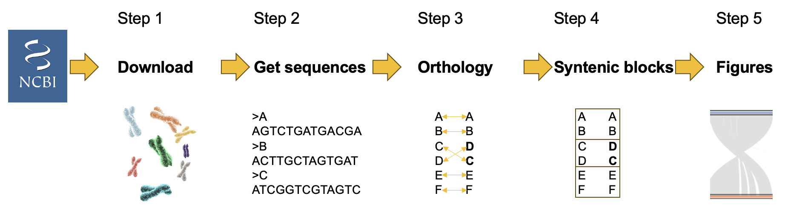

# nf-synteny

A simple pipeline to run a macro synteny analysis. 

It is under development, so if you wish to use the pipeline for your own research, please contact us (ecoflow.ucl [at] gmail.com). 
We can give you the up to date detail for the methods and the up to date figures. When it is published we will release a final version.

Synteny is the study of chromosome arrangement and gene order. Over evolutionary time, two species diverge from the state of the common ancestor, due to a variety of structural changes. These include indels, inversions, translocations, fusions and fissions. This pipeline aims to produce common synteny plots, as well as tables documenting the types of syntenic changes.

The pipeline takes a csv (comma separated value) file as input, which contains the species you wish to compare followed by their RefSeq ID. Genomes must be chromosome level assemblies, with a maximum of 50 chromosomes/scaffolds. 

The main pipeline logic is as follows:



* Downloads the genome and gene annotation files `[DOWNLOAD]`.
* Extract gene fasta sequences `[GFFREAD]`.
* Finds orthologous genes using last `[JCVI]`.
* Find syntenic block using MCScanX `[SYNTENY]`.
* **FUTURE**: Plot figures and create summary output tables `[PLOT_SCORE]`, `[PLOT_TREE]` and `[SUMMARISE_PLOTS]`.

## Tutorial

We have a short [tutorial](https://github.com/Eco-Flow/synteny/blob/main/docs/Gitpod_tutorial.md) to help you test and explore the pipeline.

## Installation

Nextflow pipelines require a few prerequisites. There is further documentation on the nf-core webpage [here](https://nf-co.re/docs/usage/installation), about how to install Nextflow.

### Prerequisites

- [Docker](https://docs.docker.com/engine/install/) or [Singularity](https://docs.sylabs.io/guides/3.11/admin-guide/installation.html).
- [Java](https://www.java.com/en/download/help/download_options.html) and [openJDK](https://openjdk.org/install/) >= 8 (**Please Note:** When installing Java versions are `1.VERSION` so `Java 8` is `Java 1.8`).
- [Nextflow](https://www.nextflow.io/docs/latest/getstarted.html) >= `v23.07.0`.

### Install

To install the pipeline please use the following commands but replace VERSION with a [release](https://github.com/Eco-Flow/synteny/releases).

`wget https://github.com/Eco-Flow/synteny/archive/refs/tags/VERSION.tar.gz -O - | tar -xvf -`

or

`curl -L https://github.com/Eco-Flow/synteny/archive/refs/tags/VERSION.tar.gz --output - | tar -xvf -`

This will produce a directory in the current directory called `synteny-VERSION` which contains the pipeline.

## Inputs

### Required

* `--input /path/to/csv/file` - A singular csv file as input in one of the two formats stated below.

This csv can take 2 forms:
* A 2 field csv where each row is a unique species name followed by a Refseq genome reference ID (**NOT** a Genbank reference ID) i.e. `data/Example-accession.csv`. The pipeline will download the relevant genome fasta file and annotation gff3 (or gff augustus) file.
* A 3 field csv where each row is a unique species name, followed by an absolute path to a genome fasta file, followed by an absolute path to an annotation gff3 (or gff augustus) file i.e. `data/Example-local.csv`. Input can be gzipped (.gz) or not.

**Please Note:** The genome has to be chromosome level not contig level.

2 fields (Name,Refseq_ID):
```
Drosophila_yakuba,GCF_016746365.2
Drosophila_simulans,GCF_016746395.2
Drosophila_santomea,GCF_016746245.2
```

3 fields (Name,genome.fna,annotation.gff):
```
Drosophila_yakuba,data/Drosophila_yakuba/genome.fna.gz,data/Drosophila_yakuba/genomic.gff.gz
Drosophila_simulans,data/Drosophila_simulans/genome.fna.gz,data/Drosophila_simulans/genomic.gff.gz
Drosophila_santomea,data/Drosophila_santomea/genome.fna.gz,data/Drosophila_santomea/genomic.gff.gz
```

### Optional

* `--outdir /path/to/output/directory` - A path to the output directory where the results will be written to (**Default:** `Results`).
* `--hex /path/to/hex/file` - A path to a file containing a singular, unique hex code on each line to be used when painting chromosomes (**Default:** `data/unique_hex`).
* `--go /path/to/directory/containing/species/hash/files` - A path to a directory containing a hash file for each species in the analysis i.e. `data/go_input/hash_files`. These hash files can be generated by running the [Goatee](https://github.com/chriswyatt1/Goatee) pipeline.
* `--tree /path/to/tree/file` - A path to a file containing a phylogenetic tree for all species in Newick format i.e. `data/score_tree_input/tree.txt`.
* `--clean` - A true or false value assigned to this parameter will determine whether the work directory is automatically deleted or not if the pipeline is successful. Deleting the work directory saves space however it will not be possible to use this work directory in future for caching (**Default:** `false`).
* `--architecture` - An `amd` or `arm` value assigned to this parameter determines whether containers built for the amd or arm CPU architecture are used (**Default:** `amd`).
* `--help` - A true value assigned to this parameter will cause the help message to be displayed instead of pipeline running (**Default:** `false`).
* `--custom_config` - A path or URL to a custom configuration file.
* `--jcvi_ortholog_arguments` - Add additional flags for the jcvi ortholog (last step). If you wish to change:
1. the score cutoff [default: 0.7] --cscore=CSCORE
2. Extent of flanking regions to search [default: 20]   --dist=DIST
3. Minimum number of anchors in a cluster [default: 4] -n N, --min_size=N
4. Quota align parameter [default: none]  --quota=QUOTA (e.g.: 1:1 to remove duplications)

(**Default:** `--no_strip_names`).

## Profiles

This pipeline is designed to run in various modes that can be supplied as a comma separated list i.e. `-profile profile1,profile2`.

### Container Profiles

Please select one of the following profiles when running the pipeline.

* `docker` - This profile uses the container software Docker when running the pipeline. This container software requires root permissions so is used when running on cloud infrastructure or your local machine (depending on permissions). **Please Note:** You must have Docker installed to use this profile.
* `singularity` - This profile uses the container software Singularity when running the pipeline. This container software does not require root permissions so is used when running on on-premise HPCs or you local machine (depending on permissions). **Please Note:** You must have Singularity installed to use this profile.
* `apptainer` - This profile uses the container software Apptainer when running the pipeline. This container software does not require root permissions so is used when running on on-premise HPCs or you local machine (depending on permissions). **Please Note:** You must have Apptainer installed to use this profile.

### Optional Profiles

* `local` - This profile is used if you are running the pipeline on your local machine.
* `aws_batch` - This profile is used if you are running the pipeline on AWS utilising the AWS Batch functionality. **Please Note:** You must use the `Docker` profile with with AWS Batch.
* `test` - This profile is used if you want to test running the pipeline on your infrastructure. **Please Note:** You do not provide any input parameters if this profile is selected but you still provide a container profile.

## Custom Configuration

If you want to run this pipeline on your institute's on-premise HPC or specific cloud infrastructure then please contact us and we will help you build and test a custom config file. This config file will be published to our [configs repository](https://github.com/Eco-Flow/configs). 

## Running the Pipeline

**Please note:** The `-resume` flag uses previously cached successful runs of the pipeline.

* Running the pipeline with local and Docker profiles:
`nextflow run main.nf -profile docker,local -resume --input data/Example-accession.csv`

* Running the pipeline with Singularity and test profiles:
`nextflow run main.nf -profile singularity,test`

* Running the pipeline with all parameters:
`nextflow run main.nf -profile apptainer,local -resume --input data/Example-local.csv --clean false --architecture arm --go data/go_input/hash_files --tree data/score_tree_input/tree.txt`

* Running the pipeline with a custom config file:
`nextflow run main.nf -profile docker,aws_batch -resume --input data/Example-accession.csv --custom_config /path/to/custom/config`

## Results

Once completed, your output directory should be called `Results`, unless you specified another name:

Subdirectories:

`Figures`
1. `Karyotype_plots` - Karyotype plots of each pairwise comparison.(<Species1><Species2>.karyotype.pdf). Showing a 1 to 1 chromosome mapping with lines drawn between syntenic chromosomes.
2. `Dotplot` - (<Species1><Species2>.pdf). Showing the chromosome synteny as a dot plot.
3. `Depth_plot` - (<Species1><Species2>.depth.pdf). Percentage of genome that correspond to non-orthlogous (0), 1to1 or 1toMany orthologs detected.
4. `Painted_chromosomes` - (<Species1><Species2>.chromo.pdf).Showing on graphic chromosomes, which sections are syntenic between two species in colours.

`Data`
1. `Gffread` -  Species gene fasta files (<Species>.nucl.fa), plus reformatted gff files (<Species>.gff_for_jvci.gff3).
2. `Anchors` - (<Species1><Species2>.anchors). Anchor files documenting the MSCanX genes in syntenic blocks. Using the lifted function from JCVI.
3. `Last` - Filtered last results for each pairwise run. Filtered using default settings from JCVI.

`Tables`
1. `Trans_Inversion_junction_merged.txt` - A summary of the types of syntenic break between sets of anchors.
2. `Paired_anchor_change_junction_prediction` - A folder with each pairwise analysis of junction changes between syntenic blocks.
3. `My_scores.tsv` - A table (pairwise) of number of syntenic gene pairs, as well as the max and average syntenic block length (in numbers of genes)
4. `Synteny_matrix.tsv` - A Matrix of syntenic gene pair totals (pairwise).
5. `Trans_location_version.out.txt` - A Table of scores (pairwise), documenting numbers of scaffolds, syntenic block, genes, as well as a variety of scores.
6. `Synt_gene_scores` -  A folder with pairwise gene scores. Scores are based on the distance to nearest syntenic break. Where '1' means a gene in on the edge of a syntenic block. 
7. `My_sim_cores.tsv` -  A Matrix containing nucleotide percentage similarities.
8. `My_comp_synteny_similarity.tsv` - A Matrix containing pairwise nucleotide percentages and total number of syntenic genes.

All of the pipeline run information can be found inside `pipeline_info`.


## Citation

This pipeline is not yet published. If you use this pipeline for your research please cite the main tool set we use (JCVI):

"Tang et al. (2008) Synteny and Collinearity in Plant Genomes. Science".

Ensure you record the *release* of the pipeline that you ran, as versions will change over time, so it is important to record exact releases. 

## Contact Us

If you need any support do not hesitate to contact us at any of:

`ecoflow.ucl [at] gmail.com`

`c.wyatt [at] ucl.ac.uk`