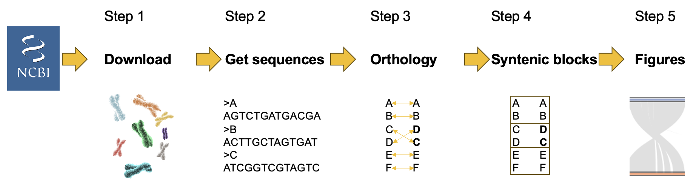

# Eco-Flow/synteny

A simple pipeline to run a macro synteny analysis across more distant phylogenetic distances. 

It is under development, so if you wish to use the pipeline for your own research, please contact us (ecoflow.ucl [at] gmail.com). 
We can give you the up to date detail for the methods and the up to date figures. When it is published we will release a final version.

Synteny is the study of chromosome arrangement and gene order. Over evolutionary time, two species diverge from the state of the common ancestor, due to a variety of structural changes. These include indels, inversions, translocations, fusions and fissions. This pipeline aims to produce common synteny plots, as well as tables documenting the types of syntenic changes.

The pipeline takes a csv (comma separated value) file as input, which contains the species you wish to compare followed by their RefSeq ID. Genomes must be chromosome level assemblies, with a maximum of 50 chromosomes/scaffolds. 

The main pipeline logic is as follows:



* Downloads the genome and gene annotation files `[DOWNLOAD]`.
* Extract gene fasta sequences `[GFFREAD]`.
* Finds orthologous genes using last `[JCVI]`.
* Find syntenic block using MCScanX `[SYNTENY]`.
* **FUTURE**: Plot figures and create summary output tables `[PLOT_SCORE]`, `[PLOT_TREE]` and `[SUMMARISE_PLOTS]`.

## Tutorial

We have a short [tutorial](https://github.com/Eco-Flow/synteny/blob/main/docs/Gitpod_tutorial.md) to help you test and explore the pipeline.

## Installation

Nextflow pipelines require a few prerequisites. There is further documentation on the nf-core webpage [here](https://nf-co.re/docs/usage/installation), about how to install Nextflow.

### Prerequisites

- [Docker](https://docs.docker.com/engine/install/) or [Singularity](https://docs.sylabs.io/guides/3.11/admin-guide/installation.html).
- [Java](https://www.java.com/en/download/help/download_options.html) and [openJDK](https://openjdk.org/install/) >= 8 (**Please Note:** When installing Java versions are `1.VERSION` so `Java 8` is `Java 1.8`).
- [Nextflow](https://www.nextflow.io/docs/latest/getstarted.html) >= `v26` (tested on `v26.04.6`).

**Please Note:** From this release the pipeline uses the strict configuration and script syntax introduced in Nextflow v26, so it will **not** run on older versions of Nextflow. If you are pinned to Nextflow `v25`, use release `v4.0.1` or earlier.

### Install

To install the pipeline please use the following commands but replace VERSION with a [release](https://github.com/Eco-Flow/synteny/releases).

`wget https://github.com/Eco-Flow/synteny/archive/refs/tags/VERSION.tar.gz -O - | tar -xvf -`

or

`curl -L https://github.com/Eco-Flow/synteny/archive/refs/tags/VERSION.tar.gz --output - | tar -xvf -`

This will produce a directory in the current directory called `synteny-VERSION` which contains the pipeline.

## Inputs

### Required

* `--input /path/to/csv/file` - A singular csv file as input in one of the two formats stated below.

This csv can take 2 forms:
* A 2 field csv where each row is a unique species name followed by a Refseq genome reference ID (**NOT** a Genbank reference ID) i.e. `data/Example-accession.csv`. The pipeline will download the relevant genome fasta file and annotation gff3 (or gff augustus) file.
* A 3 field csv where each row is a unique species name, followed by an absolute path to a genome fasta file, followed by an absolute path to an annotation gff3 (or gff augustus) file i.e. `data/Example-local.csv`. Input can be gzipped (.gz) or not.

**Please Note:** The genome has to be chromosome level not contig level.

2 fields (Name,Refseq_ID):
```
Drosophila_yakuba,GCF_016746365.2
Drosophila_simulans,GCF_016746395.2
Drosophila_santomea,GCF_016746245.2
```

3 fields (Name,genome.fna,annotation.gff):
```
Drosophila_yakuba,data/Drosophila_yakuba/genome.fna.gz,data/Drosophila_yakuba/genomic.gff.gz
Drosophila_simulans,data/Drosophila_simulans/genome.fna.gz,data/Drosophila_simulans/genomic.gff.gz
Drosophila_santomea,data/Drosophila_santomea/genome.fna.gz,data/Drosophila_santomea/genomic.gff.gz
```

### Optional

* `--outdir /path/to/output/directory` - A path to the output directory where the results will be written to (**Default:** `results`).
* `--hex /path/to/hex/file` - A path to a file containing a singular, unique hex code on each line to be used when painting chromosomes (**Default:** `data/unique_hex`).
* `--go /path/to/directory/containing/species/hash/files` - A path to a directory containing a hash file for each species in the analysis i.e. `data/go_input/hash_files`. These hash files can be generated by running the [Goatee](https://github.com/chriswyatt1/Goatee) pipeline.
* `--tree /path/to/tree/file` - A path to a file containing a phylogenetic tree for all species in Newick format i.e. `data/score_tree_input/tree.txt`.
* `--score` - Calculate synteny scores and write the summary tables of syntenic changes to the `tables` output directory (**Default:** `false`, so **no `tables` directory is produced unless you pass this flag**). The scoring methods behind these tables are still being finalised ahead of publication, so treat the output as provisional. If a `--tree` is also supplied the tree-aware scoring is used instead.
* `--chromopaint` - Produce the painted chromosome figures, written to the `figures` output directory (**Default:** `false`).
* `--clean` - A true or false value assigned to this parameter will determine whether the work directory is automatically deleted or not if the pipeline is successful. Deleting the work directory saves space however it will not be possible to use this work directory in future for caching (**Default:** `false`).
* `--architecture` - An `amd` or `arm` value assigned to this parameter determines whether containers built for the amd or arm CPU architecture are used (**Default:** `amd`).
* `--help` - A true value assigned to this parameter will cause the help message to be displayed instead of pipeline running (**Default:** `false`).
* `--custom_config` - A path or URL to a custom configuration file.

**Please Note:** The `--max_cpus`, `--max_memory` and `--max_time` parameters were removed in this release. Nextflow v26 caps resources with the built-in `process.resourceLimits` setting instead, so use a custom config (or `-c`) to change the limits for your infrastructure.
* `--jcvi_ortholog_arguments` - Add additional flags for the jcvi ortholog (last step). If you wish to change:
1. the score cutoff [default: 0.7] --cscore=CSCORE
2. Extent of flanking regions to search [default: 20]   --dist=DIST
3. Minimum number of anchors in a cluster [default: 4] -n N, --min_size=N
4. Quota align parameter [default: none]  --quota=QUOTA (e.g.: 1:1 to remove duplications)

(**Default:** `--no_strip_names`).

## Profiles

This pipeline is designed to run in various modes that can be supplied as a comma separated list i.e. `-profile profile1,profile2`.

### Container Profiles

Please select one of the following profiles when running the pipeline.

* `docker` - This profile uses the container software Docker when running the pipeline. This container software requires root permissions so is used when running on cloud infrastructure or your local machine (depending on permissions). **Please Note:** You must have Docker installed to use this profile.
* `singularity` - This profile uses the container software Singularity when running the pipeline. This container software does not require root permissions so is used when running on on-premise HPCs or you local machine (depending on permissions). **Please Note:** You must have Singularity installed to use this profile.
* `apptainer` - This profile uses the container software Apptainer when running the pipeline. This container software does not require root permissions so is used when running on on-premise HPCs or you local machine (depending on permissions). **Please Note:** You must have Apptainer installed to use this profile.

### Optional Profiles

* `local` - This profile is used if you are running the pipeline on your local machine.
* `aws_batch` - This profile is used if you are running the pipeline on AWS utilising the AWS Batch functionality. **Please Note:** You must use the `Docker` profile with with AWS Batch.
* `test` - This profile is used if you want to test running the pipeline on your infrastructure. **Please Note:** You do not provide any input parameters if this profile is selected but you still provide a container profile.

## Custom Configuration

If you want to run this pipeline on your institute's on-premise HPC or specific cloud infrastructure then please contact us and we will help you build and test a custom config file. This config file will be published to our [configs repository](https://github.com/Eco-Flow/configs). 

## Running the Pipeline

**Please note:** The `-resume` flag uses previously cached successful runs of the pipeline.

* Running the pipeline with Singularity profiles and a chosen input csv file:
`nextflow run main.nf -profile singularity -resume --input data/Example-accession.csv`

* Running the pipeline with Docker and test profiles:
`nextflow run main.nf -resume -profile docker,test`

* Running the pipeline so that the tables of syntenic changes and the painted chromosomes are also produced:
`nextflow run main.nf -resume -profile docker,test --score --chromopaint`

* Running the pipeline with all parameters:
`nextflow run main.nf -profile docker,local -resume --input data/Example-local.csv --go data/go_input/hash_files --tree data/score_tree_input/tree.txt --ribbon Drosophila_yakuba,Drosophila_simulans,Drosophila_santomea --score`

* Running the pipeline with a custom config file:
`nextflow run main.nf -profile docker,aws_batch -resume --input data/Example-accession.csv --custom_config /path/to/custom/config`

## Results

Once completed, your output directory should be called `results`, unless you specified another name:

Subdirectories:

`figures`
1. `karyotype_plots` - Karyotype plots of each pairwise comparison.(<Species1><Species2>.karyotype.pdf). Showing a 1 to 1 chromosome mapping with lines drawn between syntenic chromosomes.
2. `dotplots` - (<Species1><Species2>.pdf). Showing the chromosome synteny as a dot plot.
3. `depth_plots` - (<Species1><Species2>.depth.pdf). Percentage of genome that correspond to non-orthlogous (0), 1to1 or 1toMany orthologs detected.
4. `painted_chromosomes` - (<Species1><Species2>.chromo.pdf).Showing on graphic chromosomes, which sections are syntenic between two species in colours. **Only produced when `--chromopaint` is supplied.**

`output_data`
1. `gffread` -  Species gene fasta files (<Species>.nucl.fa), plus reformatted gff files (<Species>.gff_for_jvci.gff3).
2. `anchors` - (<Species1><Species2>.anchors). Anchor files documenting the MSCanX genes in syntenic blocks. Using the lifted function from JCVI.
3. `last` - Filtered last results for each pairwise run. Filtered using default settings from JCVI.

`tables` - **Only produced when `--score` is supplied.** Without that flag the run stops after the synteny plots and no `tables` directory is written.

1. `Trans_Inversion_junction_merged.txt` - A summary of the types of syntenic break between sets of anchors.
2. `Paired_anchor_change_junction_prediction` - A folder with each pairwise analysis of junction changes between syntenic blocks.
3. `My_scores.tsv` - A table (pairwise) of number of syntenic gene pairs, as well as the max and average syntenic block length (in numbers of genes)
4. `Synteny_matrix.tsv` - A Matrix of syntenic gene pair totals (pairwise).
5. `Trans_location_version.out.txt` - A Table of scores (pairwise), documenting numbers of scaffolds, syntenic block, genes, as well as a variety of scores.
6. `Synt_gene_scores` -  A folder with pairwise gene scores. Scores are based on the distance to nearest syntenic break. Where '1' means a gene in on the edge of a syntenic block. 
7. `My_sim_cores.tsv` -  A Matrix containing nucleotide percentage similarities.
8. `My_comp_synteny_similarity.tsv` - A Matrix containing pairwise nucleotide percentages and total number of syntenic genes.

All of the pipeline run information can be found inside `pipeline_info`.

## Ancestral genome reconstruction (`--mode algo`)

`main.nf` is a thin dispatcher: it selects between two named workflows based on `--mode`, both
living under `workflows/`. `PAIRWISE_SYNTENY` (`workflows/pairwise_synteny.nf`) is the default
pairwise workflow described above. Alongside it, **ALGO** (`workflows/algo.nf`) reconstructs
ancestral linkage groups and ancestral gene order across many species at once, rather than
comparing genomes pairwise. It follows the core comparative-genomics method of Maulana et al. 2026
(bioRxiv 2026.07.17.739156, "338 coleopteran genomes reveal exceptional rearrangement variation
compared to other insect orders"):

* Calls single-copy orthologues per genome with **BUSCO** (genome mode, metaeuk) `[BUSCO]`.
* Filters to `Complete` markers (optionally dropping unlocalised scaffolds or a Y chromosome via
  `--exclude_scaffolds`) `[BUSCO_FILTER]`.
* Infers ancestral linkage groups and fission/fusion events across a species tree with
  **[Syngraph](https://github.com/A-J-F-Mackintosh/syngraph)** `[SYNGRAPH]`.
* Reconstructs ancestral gene order (contiguous ancestral regions, CARs) for the deepest common
  ancestor with **[AGORA](https://github.com/DyogenIBENS/Agora)** `[AGORA_PREP]`, `[AGORA]`.
* Compares extant gene order to those CARs to estimate a per-chromosome gene-order fragmentation
  index `[FRAGMENTATION_INDEX]`.

This only covers the paper's core reconstruction pipeline. The paper's many downstream statistical
analyses (chromosome-number evolution models, TE/centromere/repeat enrichment, cross-order
comparisons, ordination, etc.) are one-off research analyses run on top of this output and are not
part of the subworkflow.

**Please note:** the ALGO subworkflow shares the pipeline's genome-acquisition step
(`--input`, same 2-column NCBI-accession / 3-column local-path CSV as the default workflow, via the
`GENOME_ACQUISITION` subworkflow in `subworkflows/local/`) but otherwise runs independently -- it
ignores `--score`, `--go`, `--chromopaint`, `--tree` and the other pairwise-workflow flags, and the
pairwise workflow ignores everything below. ALGO itself is composed of two further local
subworkflows: `SPECIES_TREE` (optional, see `--iqtree_species_tree` below) and
`ANCESTRAL_RECONSTRUCTION` (BUSCO -> Syngraph -> AGORA -> fragmentation index).

### ALGO inputs

* `--mode algo` - **Required.** Selects this subworkflow instead of the default pairwise one.
* `--input` - Same samplesheet as the default workflow. BUSCO only needs the genome FASTA (it calls
  genes itself), but the GFF column of a 3-column CSV is used too when `--iqtree_species_tree` is
  set (see below).
* `--species_tree` / `--iqtree_species_tree` - **Exactly one of these two is required.** Either
  supply a Newick species tree covering every species in `--input` directly via `--species_tree`
  (used by both Syngraph and AGORA), or set `--iqtree_species_tree` to build one from the same
  genomes instead (see "Building the species tree with OrthoFinder + IQ-TREE" below).
* `--busco_lineage` - **Required.** BUSCO lineage dataset, e.g. `coleoptera_odb12`.
* `--syngraph_reference` - **Required.** Reference taxon (must be one of the species names in
  `--input`) that Syngraph records rearrangements against.
* `--exclude_scaffolds` - Optional TSV of `species<TAB>scaffold_name` rows to drop before Syngraph
  and AGORA (e.g. unlocalised scaffolds or a Y chromosome).
* `--syngraph_m` (default `10`) / `--syngraph_r` (default `2`) - Syngraph's marker threshold and
  rearrangement model (`2` = fissions/fusions only, `3` = adds reciprocal translocations).
* `--busco_container`, `--syngraph_container`, `--agora_container` - Container images for each tool.
  BUSCO defaults to the public `ezlabgva/busco` image. **Syngraph and AGORA have no published
  images yet** -- build them locally first (see below).

### Building the Syngraph and AGORA containers

```
docker build --platform linux/amd64 -t synteny-syngraph:local containers/syngraph/
docker build -t synteny-agora:local containers/agora/
```

Both Dockerfiles are local-only for now (not published to a registry). Syngraph's dependencies
(graph-tool, pygraphviz, an old pinned numpy/networkx) are only reliably available as linux-64
conda builds, hence the `--platform linux/amd64` (Docker will emulate this on Apple Silicon).

### Building the species tree with OrthoFinder + IQ-TREE (`--iqtree_species_tree`)

Instead of supplying `--species_tree` yourself, set `--iqtree_species_tree` to build one from the
same genomes, following the tree-building steps of
[Eco-Flow/excon (tree_subsampling branch)](https://github.com/Eco-Flow/excon/tree/tree_subsampling):

1. `[LONGEST]`, `[GFFREAD]` (reused from the default pairwise workflow) and `[EXTRACT_PROTEINS]`
   turn each species' genome + GFF annotation into a single-longest-isoform protein FASTA.
2. `[ORTHOFINDER]` calls orthogroups across all species (`Orthogroups.tsv`). By default it runs
   with `-M dendroblast` (`--orthofinder_args`) rather than OrthoFinder's newer MSA-based default,
   since only the orthogroup assignment is used below -- OrthoFinder's own gene trees/species tree
   are discarded in favour of the supermatrix tree built in the next steps (and dendroblast is
   both faster and avoids a `famsa` dependency issue seen with the MSA-based method in this
   container).
3. `[EXTRACT_SINGLE_COPY]` writes one FASTA per strictly single-copy, complete orthogroup.
4. `[ALIGN_SINGLE_COPY]` aligns each with MAFFT (`--mafft_args`, default `--auto`).
5. `[CONCAT_SINGLE_COPY]` concatenates them into a supermatrix, with a partition file (one
   partition per orthogroup, model set via `--iqtree_partition_model`, default `AA` lets
   ModelFinder choose per orthogroup).
6. `[IQTREE_SPECIES_TREE]` runs IQ-TREE2 under the edge-proportional partition model (`-spp`), with
   `-m MFP` and 1000 ultrafast bootstrap + 1000 SH-aLRT replicates (`--iqtree_args` appends extra
   flags, e.g. `-mset LG,WAG,JTT` to narrow ModelFinder's candidates).
7. `[ROOT_TREE]` roots the resulting unrooted ML tree -- on a named outgroup via
   `--iqtree_outgroup` (comma-separated tip names matching `--input`), or midpoint-rooted if
   omitted -- since Syngraph and AGORA both need a rooted tree.

```
nextflow run main.nf -profile docker --mode algo \
  --input data/Example-accession.csv \
  --iqtree_species_tree \
  --iqtree_outgroup SomeOutgroupSpecies \
  --busco_lineage coleoptera_odb12 \
  --syngraph_reference SomeSpecies
```

Outputs are written under `<outdir>/algo/`: `orthofinder/`, `species_tree/single_copy_orthogroups/`,
`species_tree/single_copy_alignments/`, `species_tree/supermatrix/`, `species_tree/iqtree/`, and
the final `species_tree/SpeciesTree_rooted.nwk` used by Syngraph and AGORA.

### Running ALGO

```
nextflow run main.nf -profile docker --mode algo \
  --input data/Example-accession.csv \
  --species_tree tree.nwk \
  --busco_lineage coleoptera_odb12 \
  --syngraph_reference SomeSpecies
```

A small smoke-test profile is available (reuses the same local Drosophila test genomes as
`-profile test`, with a smaller/faster `diptera_odb10` BUSCO lineage purely to exercise the
pipeline mechanics -- it is not a biological claim about flies):

```
nextflow run main.nf -profile docker,test_algo
```

### ALGO outputs

Written under `<outdir>/algo/`:

* `busco/` - Raw BUSCO `full_table.tsv` per species.
* `busco_filtered/` - Filtered, 5-column single-copy marker tables per species.
* `syngraph/` - `algo.rearrangements.tsv` (inferred fission/fusion/translocation events per branch)
  plus the underlying Syngraph graph pickles.
* `agora/` - AGORA's reconstructed ancestral gene order (contiguous ancestral regions).
* `tables/fragmentation_index.tsv` - Per-chromosome `M`/`A`/`B` counts and a **provisional**
  `FI_placeholder` column. The manuscript's exact fragmentation-index formula was not recoverable
  as text from the supplied methods (it is a typeset equation); `bin/fragmentation_index.py`
  documents this and computes a plausible placeholder rescaling pending the real equation.

**Please note:** AGORA's own docs describe its "orthology groups" input as a single flat file, but a
real run showed it actually expects one file per ancestor node of the species tree, each restricted
to that node's descendant species (`agora_input/orthologyGroups/orthologyGroups.<ancestor>.list`,
templated as `orthologyGroups.%s.list` in the `agora-generic.py` call) -- otherwise AGORA's gene-tree
loader silently misparses the file instead of erroring clearly. `bin/busco_to_agora.py` and
`modules/local/algo/agora.nf` implement and test this against a real AGORA run.

## Citation

This pipeline is not yet published. If you use this pipeline for your research please cite the main tool set we use (JCVI):

"Tang et al. (2008) Synteny and Collinearity in Plant Genomes. Science".

Ensure you record the *release* of the pipeline that you ran, as versions will change over time, so it is important to record exact releases. 

## Contact Us

If you need any support do not hesitate to contact us at any of:

`ecoflow.ucl [at] gmail.com`

`c.wyatt [at] ucl.ac.uk`
